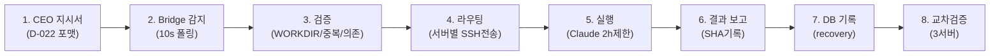
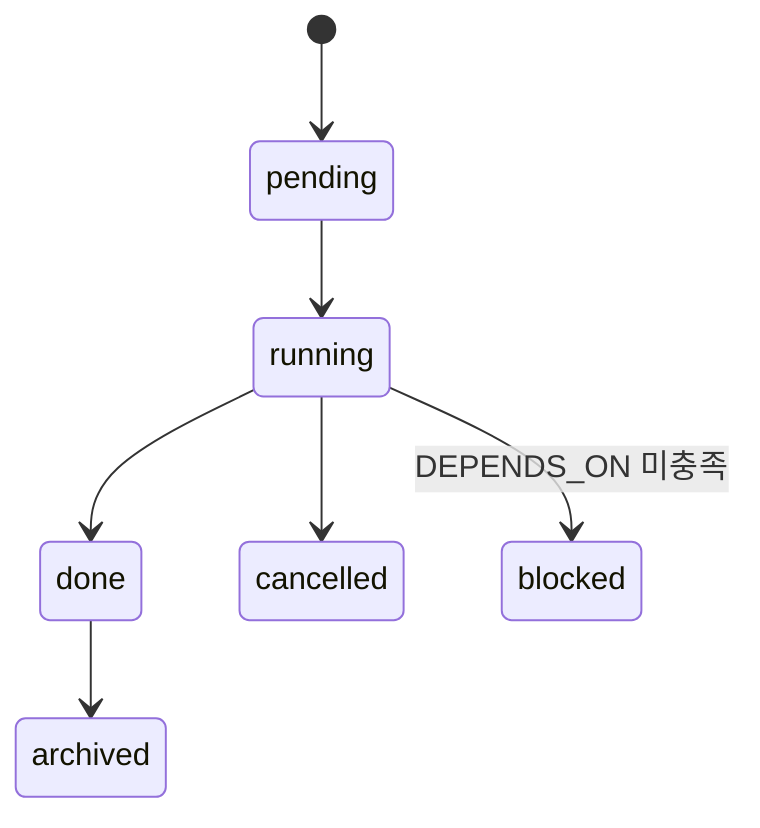
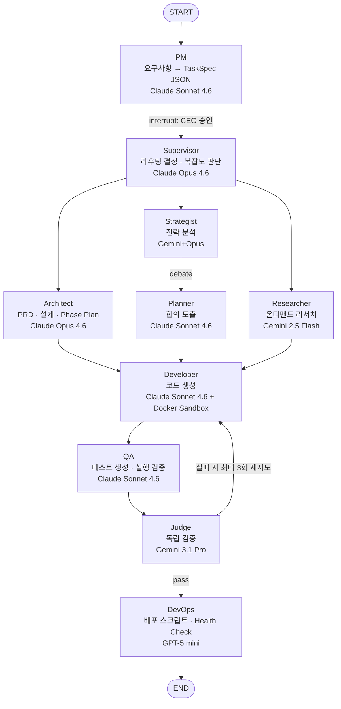

# AADS 시스템 아키텍처 v1.0
최종 업데이트: 2026-03-07 | 작성: Claude Opus 4.6 (CEO 직접 지시)

---

## 1. 시스템 개요

**AADS (Autonomous AI Development System)**: 멀티 AI 에이전트 자율 개발 플랫폼
- 8개 전문 에이전트가 LangGraph StateGraph 위에서 협업
- 3대 서버 메시 네트워크 (211 Hub, 68 AADS, 114 실행)
- CEO 대시보드로 실시간 모니터링 및 제어

---

## 2. 인프라 토폴로지

```
                    ┌─────────────────────────┐
                    │   Cloudflare CDN/SSL    │
                    │   aads.newtalk.kr       │
                    └───────────┬─────────────┘
                                │
                    ┌───────────▼─────────────┐
                    │   Nginx Reverse Proxy    │
                    │   SSL: Let's Encrypt     │
                    └───────────┬─────────────┘
                                │
    ┌───────────────────────────▼───────────────────────────┐
    │          Server 68 (68.183.183.11) — AADS Core        │
    │                                                       │
    │  ┌─────────────┐  ┌─────────────┐  ┌──────────────┐  │
    │  │aads-postgres │  │ aads-redis  │  │aads-dashboard│  │
    │  │pgvector:pg15 │  │redis:7-alp  │  │Next.js 16    │  │
    │  │:5433→5432    │  │:6379        │  │:3100         │  │
    │  │256MB shared  │  │128MB max    │  │TZ=Asia/Seoul │  │
    │  └──────┬───────┘  └─────────────┘  └──────────────┘  │
    │         │                                              │
    │  ┌──────▼─────────────────────────────────────────┐   │
    │  │           aads-server (FastAPI + LangGraph)     │   │
    │  │           :8100→8080 | Memory: 1.5GB           │   │
    │  │                                                 │   │
    │  │  ┌─────────┐ ┌──────────┐ ┌─────────────────┐  │   │
    │  │  │ 24 API  │ │ 8 Agent  │ │ 5-Layer Memory  │  │   │
    │  │  │ Routers │ │ Pipeline │ │ pgvector 1536d  │  │   │
    │  │  └─────────┘ └──────────┘ └─────────────────┘  │   │
    │  │  ┌─────────┐ ┌──────────┐ ┌─────────────────┐  │   │
    │  │  │ 11 CEO  │ │ Docker   │ │ 7 MCP Servers   │  │   │
    │  │  │ Tools   │ │ Sandbox  │ │ (FS/Git/DB/...) │  │   │
    │  │  └─────────┘ └──────────┘ └─────────────────┘  │   │
    │  └─────────────────────────────────────────────────┘   │
    └───────────────────────────────────────────────────────┘

    ┌──────────────────────┐        ┌──────────────────────┐
    │ Server 211 (Hub)     │  SSH   │ Server 114 (Worker)  │
    │ 211.188.51.113       │◄──────►│ 116.120.58.155       │
    │                      │        │                      │
    │ • bridge.py          │        │ • SF 실행             │
    │ • auto_trigger.sh    │        │ • NTV2 실행           │
    │ • session_watchdog   │        │ • NAS 유지보수        │
    │ • pipeline_monitor   │        │                      │
    │ • KIS/GO100 실행      │        │                      │
    └──────────┬───────────┘        └──────────────────────┘
               │ SSH
               ▼
          Server 68 (AADS 태스크 실행)
```

---

## 3. 8-Stage 작업 파이프라인



### 지시서 상태 흐름



---

## 4. LangGraph 에이전트 파이프라인



### 에이전트별 모델 매트릭스

| 에이전트 | 모델 | Input$/M | Output$/M | 역할 |
|---------|------|----------|-----------|------|
| PM | Claude Sonnet 4.6 | $3 | $15 | 요구사항 → TaskSpec |
| Supervisor | Claude Opus 4.6 | $5 | $25 | 라우팅, 복잡도 판단 |
| Architect | Claude Opus 4.6 | $5 | $25 | PRD, 아키텍처, Phase Plan |
| Developer | Claude Sonnet 4.6 | $3 | $15 | 코드 생성 + Sandbox 실행 |
| QA | Claude Sonnet 4.6 | $3 | $15 | 테스트 생성 + 실행 |
| Judge | Gemini 3.1 Pro | $2 | $12 | 독립 검증 (다른 모델) |
| DevOps | GPT-5 mini | $0.25 | $2 | 배포 자동화 |
| Researcher | Gemini 2.5 Flash | $0.30 | $2.50 | 온디맨드 리서치 |
| Strategist | Gemini 2.5 Flash + Opus | $0.30~5 | $2.50~25 | 전략 분석 |
| Planner | Claude Sonnet 4.6 | $3 | $15 | 기획 합의 도출 |

---

## 5. API 엔드포인트 맵 (50+ endpoints)

### 인증
| Method | Path | 용도 |
|--------|------|------|
| POST | `/auth/login` | JWT 로그인 (HS256, 24h) |
| GET | `/auth/me` | 사용자 정보 + 토큰 검증 |

### 프로젝트 (Core Workflow)
| Method | Path | 용도 |
|--------|------|------|
| GET | `/projects` | 프로젝트 목록 + 상태/진행률 |
| POST | `/projects` | 프로젝트 생성 → PM 에이전트 자동실행 |
| GET | `/projects/{id}` | 프로젝트 상세 (비용, 산출물) |
| POST | `/projects/{id}/auto_run` | 전체 파이프라인 자동 실행 |
| POST | `/projects/{id}/resume` | 체크포인트에서 재개 (승인/피드백) |
| GET | `/projects/{id}/costs` | 에이전트별 비용 내역 |

### CEO Chat (11 도구 + 의도 분류)
| Method | Path | 용도 |
|--------|------|------|
| POST | `/ceo-chat/message` | 메시지 전송 (6 의도 자동분류) |
| GET | `/ceo-chat/models` | 28개 지원 모델 목록 |
| GET | `/ceo-chat/sessions` | 세션 목록 |
| GET | `/ceo-chat/sessions/{id}` | 세션 상세 |
| POST | `/ceo-chat/end-session` | 세션 종료 |
| GET | `/ceo-chat/cost-summary` | 비용 요약 |

### 메모리 & 컨텍스트
| Method | Path | 용도 |
|--------|------|------|
| GET | `/context/system` | 시스템 메모리 전체 |
| GET | `/context/system/{category}` | 카테고리별 메모리 |
| POST | `/context/system` | 메모리 저장 (Monitor Key 인증) |
| GET | `/context/public-summary` | 공개 요약 (민감정보 제외) |
| POST | `/memory/log` | go100_user_memory 저장 |
| GET | `/memory/search` | 메모리 검색 |
| GET | `/memory/ceo-decisions` | CEO 결정 이력 |
| POST | `/memory/cross-message` | 에이전트간 메시지 |
| GET | `/memory/inbox/{agent_id}` | 에이전트 수신함 |

### 채널 & 대화
| Method | Path | 용도 |
|--------|------|------|
| GET/POST | `/channels` | 채널 CRUD |
| GET/PUT/DELETE | `/channels/{id}` | 채널 상세/수정/삭제 |
| GET | `/channels/{id}/context-package` | 브릿지용 컨텍스트 패키지 |
| GET | `/conversations` | 대화 이력 (필터/검색) |
| GET | `/conversations/stats` | 대화 통계 |

### 운영 대시보드
| Method | Path | 용도 |
|--------|------|------|
| GET | `/ops/health-check` | 서비스 상태 (postgres/redis/graph/mcp) |
| GET | `/ops/directive-lifecycle` | 지시서 상태 추적 |
| GET | `/ops/cost/summary` | 비용 집계 (프로젝트/에이전트/월별) |
| GET | `/ops/bridge-log` | 브릿지 로그 |
| POST | `/ops/maintenance/start\|end` | 유지보수 모드 |

### 워치독 & 승인
| Method | Path | 용도 |
|--------|------|------|
| POST | `/watchdog/report` | 에러 보고 (자동 기록) |
| GET | `/watchdog/errors` | 에러 목록 |
| POST | `/approval/request` | 승인 요청 (→ Telegram) |
| GET | `/approval/queue` | 대기 승인 목록 |
| POST | `/approval/{id}/approve\|reject` | CEO 승인/거부 |

### 전략 & 기획
| Method | Path | 용도 |
|--------|------|------|
| POST/GET | `/strategy-reports` | 전략 보고서 CRUD |
| POST/GET | `/project-plans` | 기획서 CRUD |
| PATCH | `/project-plans/{id}/approve` | 기획 승인 |
| POST/GET | `/artifacts` | 산출물 저장/조회 |
| GET | `/debate-logs` | 토론 이력 |
| POST/GET | `/lessons` | 교훈 기록/조회 |

### 지시서 & 문서
| Method | Path | 용도 |
|--------|------|------|
| POST | `/directives/submit` | D-022 포맷 지시서 생성 |
| GET/POST/DELETE | `/documents` | CEO 문서 관리 |

### 스트리밍
| Method | Path | 용도 |
|--------|------|------|
| GET | `/stream/project/{id}` | SSE 실시간 에이전트 실행 스트림 |

---

## 6. 데이터베이스 스키마

### 5-Layer 메모리 아키텍처

```
┌─────────────────────────────────────────────┐
│ L1: Working Memory (LangGraph State)        │
│ → 실행 중 에이전트 상태 (in-memory)            │
├─────────────────────────────────────────────┤
│ L2: Project Memory (project_memory)          │
│ → 프로젝트별 장기 기억 + pgvector 1536d       │
├─────────────────────────────────────────────┤
│ L3: Experience Memory (experience_memory)    │
│ → 프로젝트간 학습 + RIF 점수 + 시맨틱 검색    │
├─────────────────────────────────────────────┤
│ L4: System Memory (system_memory)            │
│ → HANDOVER.md 대체 (실시간 업데이트)           │
├─────────────────────────────────────────────┤
│ L5: Procedural Memory (procedural_memory)    │
│ → 에이전트별 절차 + 성공률 + 사용 횟수         │
└─────────────────────────────────────────────┘
```

### 주요 테이블

| 테이블 | 용도 | 주요 컬럼 |
|--------|------|-----------|
| `system_memory` | L4 시스템 상태 | category, key, value(JSONB), version |
| `project_memory` | L2 프로젝트 기억 | project_id, memory_type, embedding(vector) |
| `experience_memory` | L3 교차학습 | experience_type, tags[], rif_score, embedding |
| `procedural_memory` | L5 에이전트 절차 | agent_name, success_rate, use_count |
| `go100_user_memory` | 매니저 협업 | user_id, memory_type, importance(0-10) |
| `strategy_reports` | 전략 보고서 | direction, candidates(JSONB), cost_usd |
| `project_plans` | 기획서 | prd(JSONB), architecture(JSONB), status |
| `debate_logs` | 토론 이력 | strategist_message, planner_message, consensus |
| `project_artifacts` | 산출물 | artifact_type, content(JSONB), source_agent |
| `error_log` | 에러 추적 | error_hash, auto_recoverable, recovery_command |
| `recovery_log` | 복구 이력 | error_log_id(FK), success, output |
| `approval_queue` | CEO 승인 큐 | severity, status, telegram_message_id |
| `monitored_services` | 서비스 모니터링 | check_type, consecutive_failures |
| `ceo_chat_sessions` | CEO 채팅 세션 | total_turns, total_cost_usd |

---

## 7. CEO Chat 도구 시스템

### 의도 분류기 (6가지)
```
우선순위: execute > browser > dashboard > diagnosis > research > strategy

execute:   만들어, 수정해, 고쳐, 배포, 진행, 승인, 지시서
browser:   스크린샷, 페이지, 열어, 화면, 브라우저, 사이트
dashboard: 상태, 확인, 보고, 현황, 서버, 대시보드, 요약
diagnosis: 왜, 안돼, 오류, 에러, 문제, 분석, 실패
research:  검색, 조사, 비교, 찾아, 최신
strategy:  기획, 방향, 전략, 검토, 설계, 아키텍처
```

### 11개 도구

| 도구 | 파라미터 | 보안 제한 |
|------|---------|----------|
| `read_file` | path | /root/aads/ 하위만, /etc /proc /root/.ssh 차단 |
| `read_github` | repo, path, branch | moongoby-GO100/* 전용 |
| `search_logs` | source, keyword | 최근 100줄, 10KB |
| `query_db` | sql | SELECT 전용, 50행, DML/DDL 차단 |
| `fetch_url` | url | GET 전용, 20KB |
| `browser_navigate` | url | *.newtalk.kr, github.com 등 화이트리스트 |
| `browser_snapshot` | — | 접근성 트리 텍스트 |
| `browser_screenshot` | — | PNG base64 |
| `browser_click` | selector | CSS/텍스트 |
| `browser_fill` | selector, value | 입력 자동화 |
| `browser_tab_list` | — | 열린 탭 목록 |

---

## 8. 대시보드 (Next.js Frontend)

### 기술 스택
- Next.js 16.1.6 + React 19.2.3 + TypeScript 5
- Tailwind CSS v4 + CSS Variables 테마
- JWT 인증 (localStorage + cookie)
- SSE 스트리밍 (프로젝트 실시간)

### 페이지 라우트 맵 (26개)

| 라우트 | 용도 |
|--------|------|
| `/` | CEO 대시보드 (통계 4카드 + 프로젝트 6카드 + 최근대화 + 알림) |
| `/login` | 인증 |
| `/ceo-chat` | CEO AI 채팅 (29모델, 세션관리, 비용추적) |
| `/projects` | 프로젝트 파이프라인 (생성/실행/재개) |
| `/projects/[id]` | 프로젝트 상세 (에이전트 상태, 비용, 체크포인트) |
| `/projects/[id]/stream` | SSE 실시간 스트림 |
| `/project-status` | 프로젝트 현황 개요 |
| `/channels` | 채널 관리 (CRUD, 트리거 전송) |
| `/conversations` | 대화 아카이브 (채널별, 검색) |
| `/decisions` | CEO 결정 타임라인 |
| `/ops` | 운영 대시보드 (Health, 비용, 라이프사이클) |
| `/ops/recovery` | 복구 도구 |
| `/ops/servers` | 서버 모니터링 |
| `/server-status` | 서버 상태 (30초 자동새로고침) |
| `/managers` | 에이전트 매니저 목록 |
| `/tasks` | 태스크 대시보드 (지시서, 보고서, 분석) |
| `/reports` | 전략보고서, 기획서, 산출물 |
| `/lessons` | 교훈 아카이브 |
| `/flow` | FLOW 파이프라인 시각화 |
| `/settings` | 시스템 설정 |

### 핵심 컴포넌트

| 컴포넌트 | 용도 |
|---------|------|
| `Sidebar` | 17개 메뉴 네비게이션 |
| `Header` | 타이틀 + Health 상태 + 로그아웃 |
| `AgentStatus` | 8 에이전트 파이프라인 시각화 |
| `ModelSelector` | 29개 LLM 모델 드롭박스 |
| `CheckpointList` | 체크포인트 단계 표시 |
| `CostTracker` | 에이전트별 비용 차트 |
| `SSEMonitor` | 실시간 이벤트 모니터 |

---

## 9. 보안 아키텍처

### 인증 계층
```
┌────────────────────────┐
│ JWT (HS256, 24h)       │ ← 대시보드 로그인
├────────────────────────┤
│ Monitor Key (HMAC)     │ ← API 쓰기 작업
├────────────────────────┤
│ Rate Limit (30/min/IP) │ ← POST /context/system
├────────────────────────┤
│ Domain Whitelist       │ ← 브라우저 도구
├────────────────────────┤
│ Path Whitelist         │ ← 파일 읽기 도구
├────────────────────────┤
│ SQL Parser             │ ← SELECT 전용 제한
└────────────────────────┘
```

### Docker Sandbox 보안
- Network: `--network=none` (격리)
- Memory: 512MB 제한
- CPU: 1 core
- FS: `--read-only` + tmpfs /tmp
- Timeout: 60초 자동 kill
- 동시 실행: 최대 5개 (세마포어)

---

## 10. 비용 관리

### 제한 설정
| 항목 | 제한 | 규칙 |
|------|------|------|
| 태스크당 LLM 호출 | 15회 | R-012 |
| 태스크당 비용 | $5 | R-015, D-004 |
| 월간 비용 | $500 | 경고 80% |
| 인프라 월비용 | ~$13 | 목표 $23-63 |

### 추적 방식
- Redis: 프로젝트별 에이전트 비용 실시간 집계
- DB: ceo_chat_sessions 세션별 비용 기록
- API: `/ops/cost/summary` 대시보드 표시

---

## 11. 모니터링 & 자가치유

### 4계층 워치독
```
L1: 하트비트 (10초)
├─ 60s 미응답 → 경고 로그
├─ 120s → 진단 (CPU, mem, git status)
├─ 300s → PGID kill + recovery_log
└─ 7200s → 강제 종료

L2: 메타 워치독 (서버 211)
├─ L1 워치독 상태 모니터링
└─ 워치독 장애 → 자동 재시작

L3: 외부 센티넬
├─ L2 장애 감지 → CEO 에스컬레이션
└─ 자동 복구 절차 실행

L4: CEO 수동 검토
├─ Telegram 알림
├─ 승인 큐 (approve/reject)
└─ recovery_log DB 기록
```

### 서킷 브레이커
- 3회 연속 실패 → 5분 쿨다운 (R-016)
- 상태: circuit_breaker_state 관리

---

## 12. CEO 지침 체계 (v3.2)

### 의사결정 원칙 (D-001~D-010)
### 기술 사양 (T-001~T-012)
### 절대 규칙 (R-001~R-020)
### 프로세스 규칙 (D-016~D-029)

핵심 규칙:
- **R-001**: 완료 후 HANDOVER.md 업데이트 의무
- **R-002**: HTTP 200 확인 필수
- **D-016**: FLOW 프레임워크 (Find→Layout→Operate→Wrap up)
- **D-022**: 지시서 포맷 v2.0
- **D-024**: 모델 라우팅 (XS→haiku, S/M→sonnet, L/XL→opus)

---

## 13. 외부 연동

| 서비스 | 용도 | 프로토콜 |
|--------|------|---------|
| Anthropic API | Claude 모델 (Primary) | HTTPS, API Key |
| OpenAI API | GPT 모델 (Secondary) | HTTPS, API Key |
| Google AI API | Gemini 모델 (Tertiary) | HTTPS, API Key |
| GitHub | 소스 관리 (moongoby-GO100) | HTTPS, PAT |
| Supabase | 클라우드 DB 폴백 | PostgreSQL |
| Upstash Redis | 비용 카운터 | Redis protocol |
| Telegram Bot | CEO 알림 | Bot API |
| Docker Socket | 샌드박스 실행 | Unix socket |
| Brave Search | 웹 검색 (MCP) | HTTPS |
| E2B | 코드 인터프리터 (Phase 3+) | HTTPS |

---

## 14. 코드 규모

| 영역 | 파일 수 | 라인 수 |
|------|---------|--------|
| API 엔드포인트 | 24 | ~11,000 |
| 서비스 | 14 | ~6,000 |
| 에이전트 | 16 | ~3,000 |
| 마이그레이션 | 7 | ~500 |
| 대시보드 페이지 | 26 | ~5,300 |
| 컴포넌트 | 10 | ~1,500 |
| API 클라이언트/타입 | 4 | ~800 |
| **합계** | **~100** | **~28,000+** |
